# Iterator模式

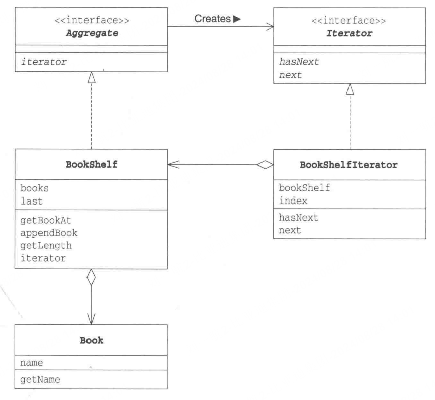


## 结构详解

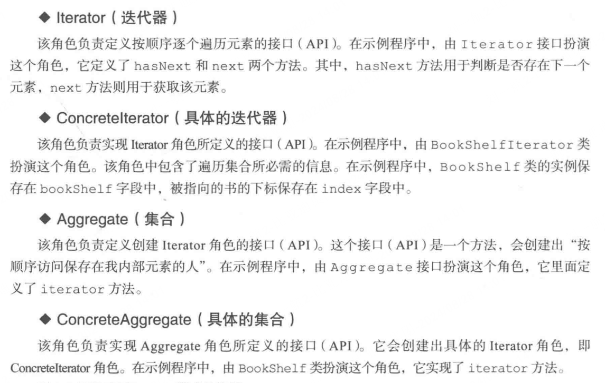


## 使用Iterator的优点

### 1.将实现与遍历分离

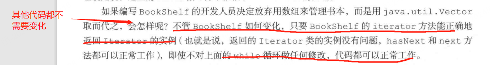


## 注意点

### 1.next（）方法

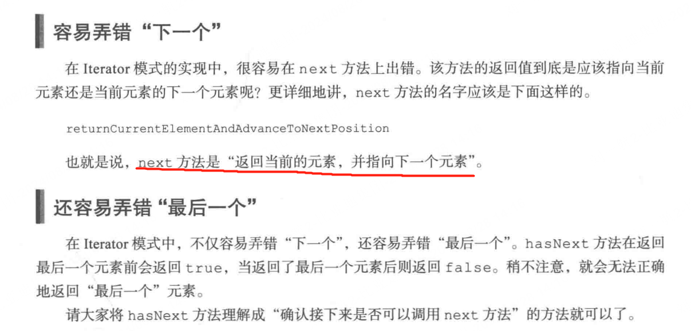


# Adapter模式

## 结构

### 类适配器模式

`PrintBanner`实现`Print`接口，继承`Banner`类，在`printBanner`中通过`printWeak`调用父类`Banner`中的`showWithParen`方法。


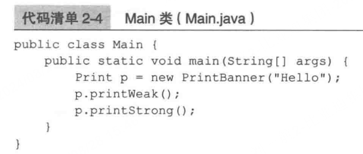

### 对象适配器模式

`PrintBanner`继承`Print`类，在`printBanner`中通过创建`Banner`实例，调用`Banner`中的`showWithParen`方法。


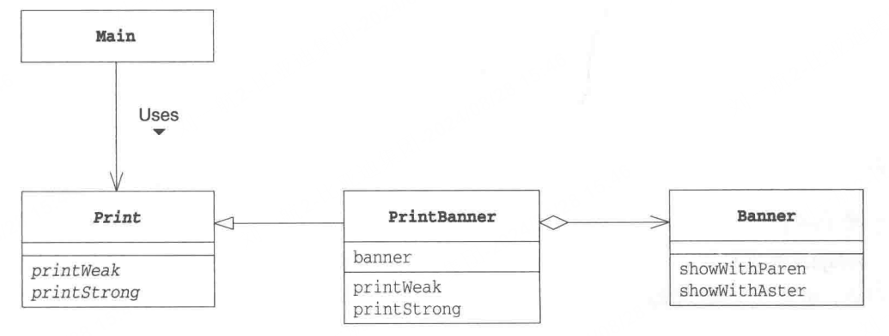

## 优点

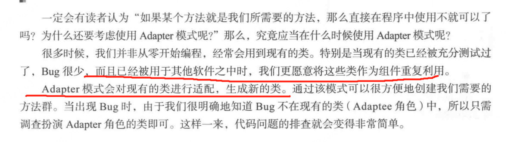

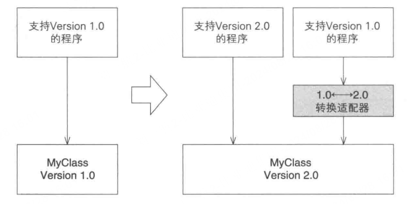


# Factory模式

## 结构

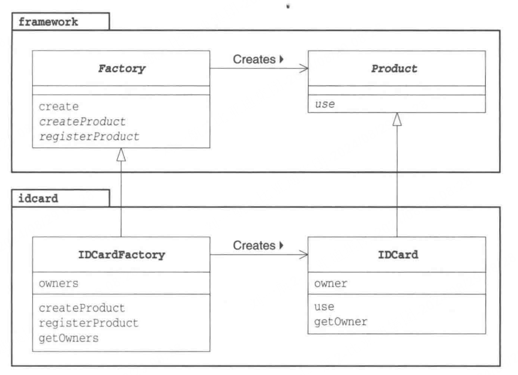


## 优点

将创建对象这一步骤单独拿出来，与主类代码进行分离。

## 其他

其实这个例子写的稍显复杂，本质上来讲factory模式只需要将创建对象的步骤拿出来即可，例如我在代码中的新增的`AnotherFactory`。

这个例子中又多写了一个Factory的基类抽象类，也没什么问题，如果后续创建的类型多可以都继承这个Factory。例如此时又有一个“个人电脑的类”，那么可以直接使用“ComputeFactory”继承“Factory”。

```java
package Factory;

public class main {
    public static void main(String[] args){
        Factory factory = new IDCardFactory();
        Product card1 = factory.create("aaa");
        Product card2 = factory.create("bbb");
        Product card3 = factory.create("ccc");
        card1.use();
        card2.use();

        Product card4 = AnotherFactory.createIDCard("ddd");
        Product card5 = AnotherFactory.createIDCard("eee");
        card4.use();

        Factory factory2 = new ComputerFactory();
        Product computer1 = factory2.create("ffff");
        computer1.use();
    }
}

```


# Prototype

## 结构

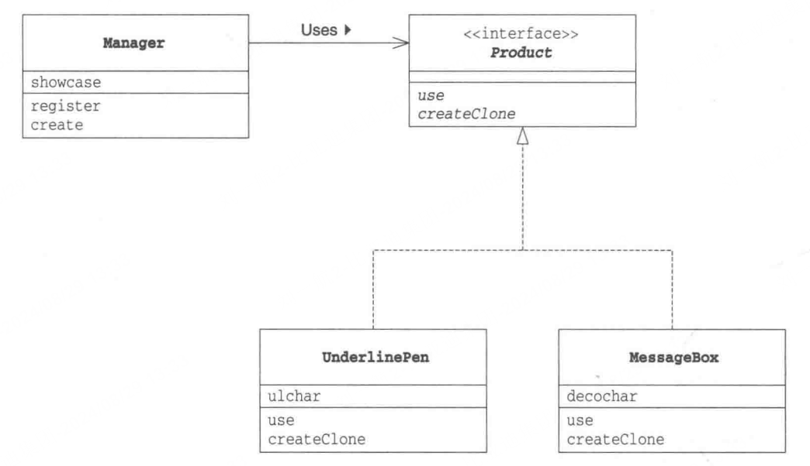

- 在`Manager`类中的`create`调用`createClone()`来通过实例创建对象

## 优点

暂时没理解通过clone创建对象的优点，至于这个结构，无非就是将创建对象的方法抽离出来，本质和工厂模式没有什么不同。


# Bridge

## 结构

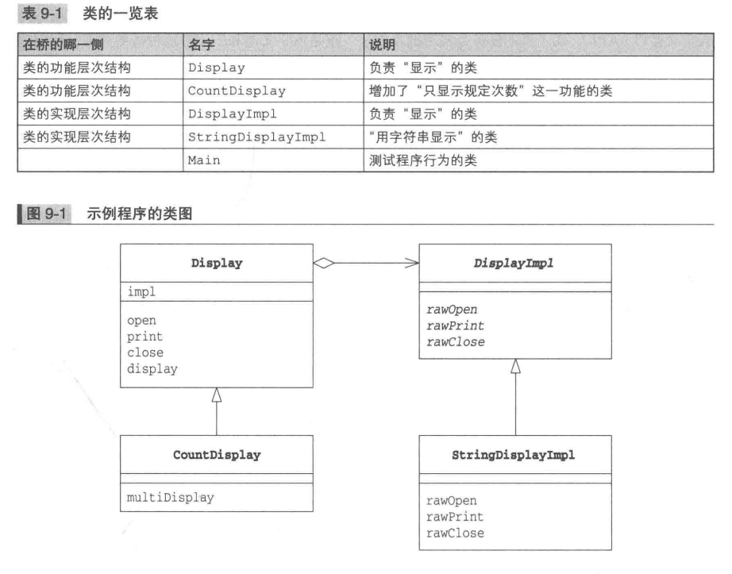

## 优点

这里先说明两个概念，类的功能层次和类的实现层次。

类的功能层次是指子类继承父类，可以得到父类的方法，同时可以写自己的方法，实现功能的扩展。

类的实现层次是指，通过接口继承的方式，类去实现接口中的方法。


1. 在这个例子中，CountDisplay继承Display，可以实现功能扩展，StringDisplayImpl实现了DisplayImpl的方法。


# Proxy

## 结构

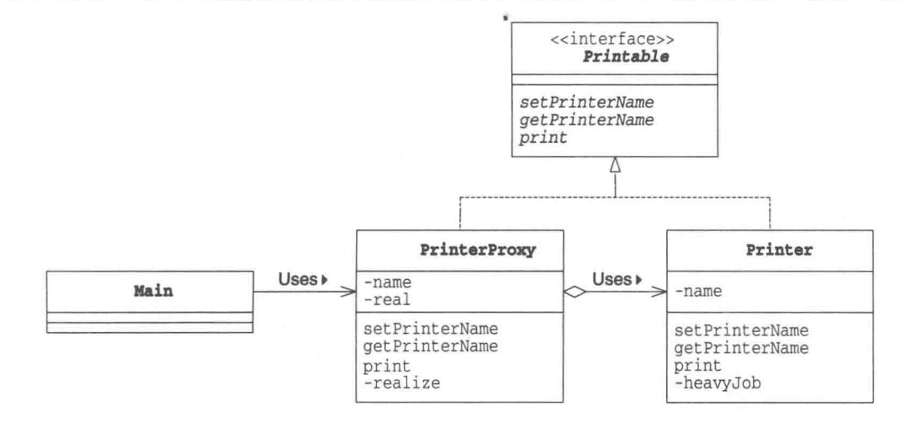


## 优点

Proxy模式的结构还是挺有意思的，**懒加载模式**。

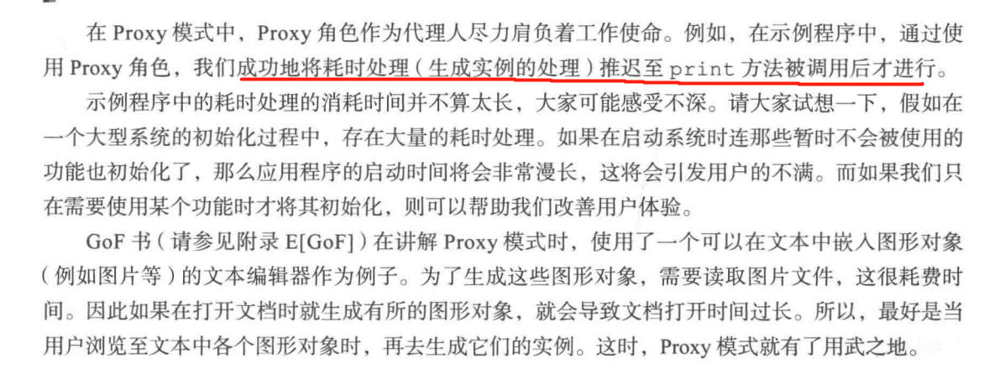

